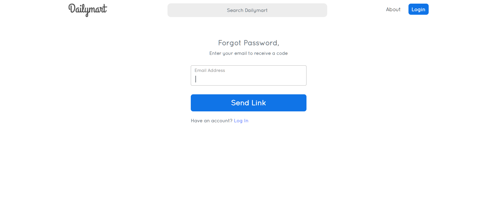
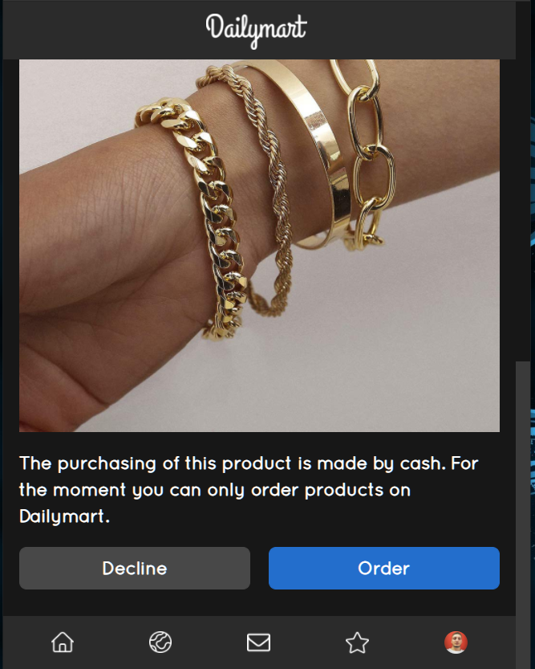

## README

# DailymartScreenshots
Provides Screenshots from the Private Repository Dailymart, which could not be made open-source for security reasons.
"Dailymart" is a Social Networking site build on top of Laravel and Vue.js frameworks. It is dedicated to giving you the very best of product sharing and exploring experience, with a focus on social media interaction. Dailymart is a social networking media that provides the ability to publish photos of material goods. It is not the only one of its kind, because this type of service can be also offered on Instagram Shop or Facebook Store, but the key of Dailymart is that it comes with a new flexible design and can be very scalable in the future when it comes to adding new features to help businesses expand larger digitally.

# Founder:
Gerald Nika (Founder & Creator).

## License
The Laravel framework is open-source software licensed under the [MIT license](https://opensource.org/licenses/MIT).

# Large Resolutions:

***

***

***

***

***

***

***

***

***

***

***

***

***

***

***

***

***

***

***

***

***

***

***

***

***

***

***

***

***

***

***

***

***

***

***

***

***

***

***

***

***

***

***

***

***

***

***

# Small Resolutions:

***

***

***

***

***

***

***

***

***

***

***

***

***

***

***

***

***

***

***

***

***

***

***
